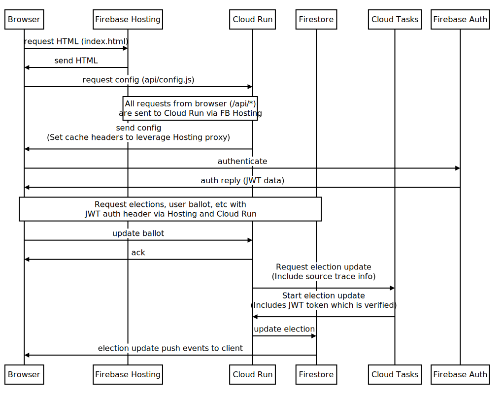

Try it out: https://knarlyvote.com

# tl;dr

A (work-in-progress) demonstration of: (1) a full-stack
[Flutter](https://flutter.dev/) application utilizing
[Firebase](https://firebase.google.com/) and
[Google Cloud](https://cloud.google.com/), and (2) ranked voting with the
[Condorcet Method](https://en.wikipedia.org/wiki/Condorcet_method).

# Components

# Event flow

# YouTube discussion about the project

From July 29, 2021

# Getting started and local development

1. Copy `server/server_config.example.yaml` to `server/server_config.yaml` and
   populate the entries. See the details in `server/lib/src/service_config.dart`
   for the expected values.

   _TODO_ explain the values needed to run locally vs to deploy.

1. Make sure you have [package:shelf_dev](https://pub.dev/packages/shelf_dev) v2
   or later installed.

1. Run `shelf_dev` from the root of the repository to start the app. It will be
   hosted at `localhost:8080`.

# Deployment

_todo_ Sketching things out here, but this is incomplete at the moment.

1. Deploy services

   1. Enable cloud tasks and create a task queue.
   1. Enable cloud run.
      1. Make sure the name of the service corresponds to the value in
         `hosting/rewrites` in `firebase.json`.
   1. Set variables using `server/tool/update_cloud_run_environment.dart`.
   1. Deploy cloud run service

2. Web app

   1. Build and deploy web app. `firebase deploy`.
